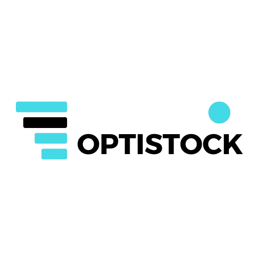

# OPTISTOCK - Smart Inventory Management System

## About OPTISTOCK

OPTISTOCK is a powerful and user-friendly inventory management system designed to help businesses efficiently track, manage, and optimize their stock. Built with Laravel, this application offers a comprehensive suite of features to streamline your inventory operations.

## Key Features

🚀 **Real-time Stock Tracking**
- Live inventory monitoring
- Automatic stock level alerts
- Minimum quantity thresholds

📊 **Smart Analytics**
- Detailed inventory reports
- Stock movement history
- Value tracking and analysis
- PDF report generation

🏷️ **Product Management**
- Categorized product organization
- SKU and barcode support
- Custom unit management
- Price tracking

👥 **Supplier Management**
- Supplier database
- Contact information
- Supply history tracking

⚡ **Quick Actions**
- Fast stock adjustments
- Instant search functionality
- Bulk operations
- Mobile-friendly interface

## System Requirements

- PHP >= 8.1
- Composer
- MySQL/PostgreSQL
- Node.js & NPM
- Web Server (Apache/Nginx)

## Installation

1. Clone the repository
\`\`\`bash
git clone https://github.com/youssefgrou/stock_management.git
\`\`\`

3. Install dependencies
\`\`\`bash
composer install
npm install
\`\`\`

4. Configure environment
\`\`\`bash
cp .env.example .env
php artisan key:generate
\`\`\`

5. Set up database
\`\`\`bash
php artisan migrate
php artisan db:seed
\`\`\`

6. Start the application
\`\`\`bash
php artisan serve
npm run dev
\`\`\`

## Security

OPTISTOCK takes security seriously. We implement:
- Role-based access control
- Secure authentication
- Data encryption
- Activity logging

## Support

For support, please email support@optistock.com or create an issue in our GitHub repository.

## License

OPTISTOCK is open-sourced software licensed under the [MIT license](https://opensource.org/licenses/MIT).

## Credits

Developed with ❤️ by OPTISTOCK Team 
